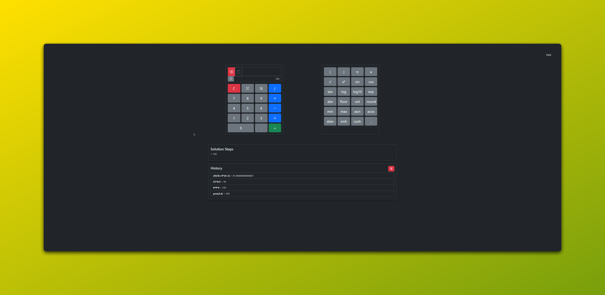

# Calculator

[](https://exelvi.github.io/calculator/)

[](https://github.com/EXELVI/calculator)
[](https://github.com/EXELVI/calculator)
[](https://getbootstrap.com/)
[](https://developer.mozilla.org/en-US/docs/Web/JavaScript)

A responsive, feature-rich calculator built with HTML, CSS, JavaScript, and Bootstrap. It supports basic arithmetic operations, advanced scientific functions, and provides a detailed step-by-step solution.

## Features

- **Basic Operations:** Addition, subtraction, multiplication, division.
- **Scientific Functions:** Trigonometric functions, logarithms, power, square root, etc.
- **Solution Steps:** Displays step-by-step solutions for complex expressions.
- **History:** Stores previous calculations for quick access.
- **Dark Mode:** Easily toggle between light and dark themes.

## Installation

1. Clone the repository:
    ```bash
    git clone https://github.com/EXELVI/calculator.git
    ```
2. Navigate to the project directory:
    ```bash
    cd calculator
    ```
3. Open `index.html` in your browser:

## Usage

- **Keyboard Support:** The calculator can be used with keyboard inputs for digits, operators, and executing the calculation (`Enter` key).
- **Copy to Clipboard:** Easily copy the current input or result to the clipboard with a single click.

## Demo

You can try the calculator live [here](https://exelvi.github.io/calculator/).

## Contributing

Contributions are welcome! Feel free to open an issue or submit a pull request if you have any suggestions or improvements.
